# Sera

Sera is a full-stack greenhouse management system: an Angular + Capacitor app for monitoring and controlling a greenhouse in real time, backed by a Laravel REST API and WebSocket server.

Growers can watch live sensor readings (temperature, humidity, soil moisture, light), control devices (fans, heaters, irrigation, lights) manually or through automation rules, get alerted on threshold breaches, and schedule calendar tasks — all synced live over WebSockets. The app is fully responsive — a native mobile experience on phones, and a purpose-built desktop dashboard layout on larger screens — and fully bilingual, switchable at any time between Albanian and English.

<p align="center">
  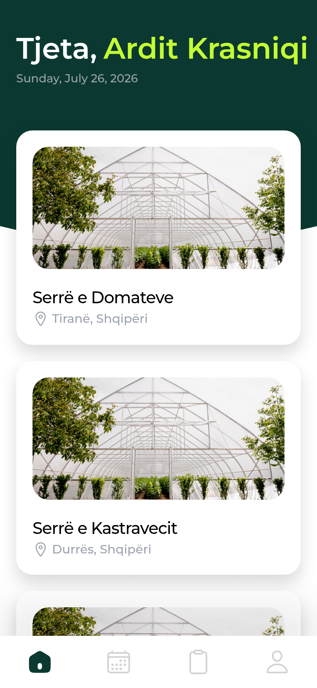
  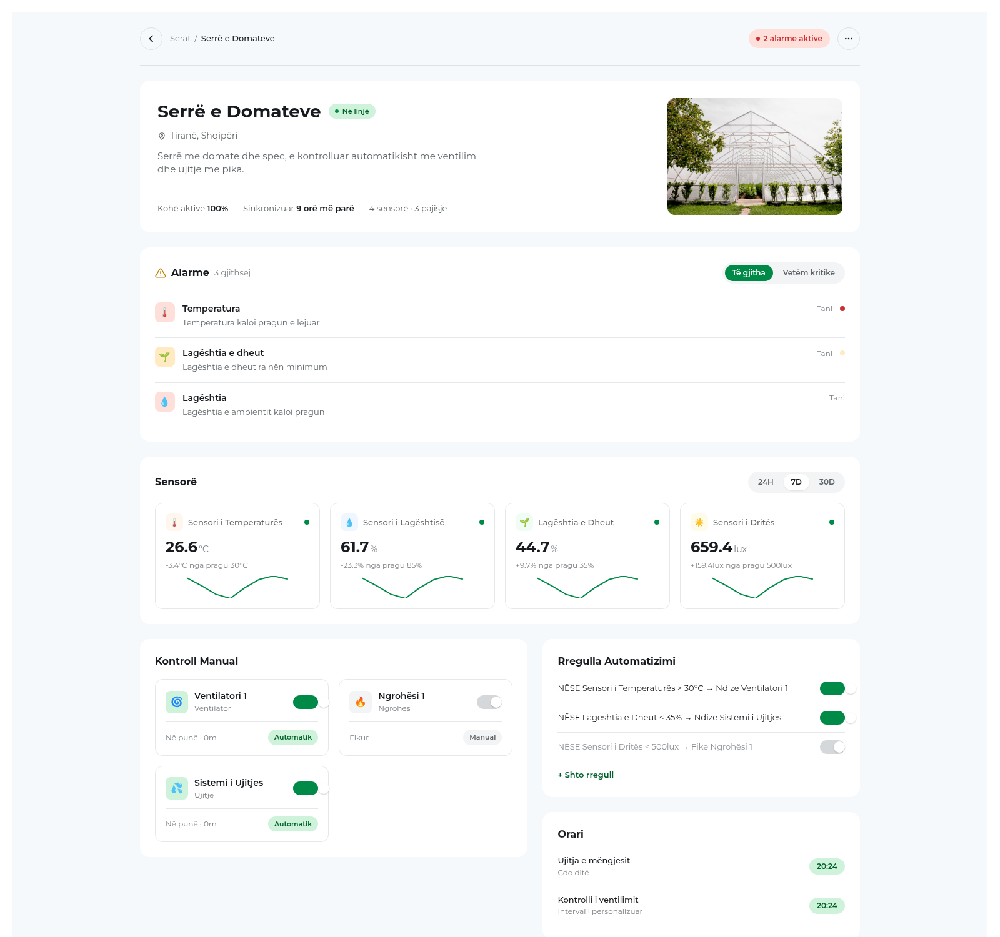
</p>

## Mobile

The primary experience: a tab-bar navigation, bottom sheets for forms, and a tabbed layout for a greenhouse's manual controls, automation rules, and alerts.

<p align="center">
  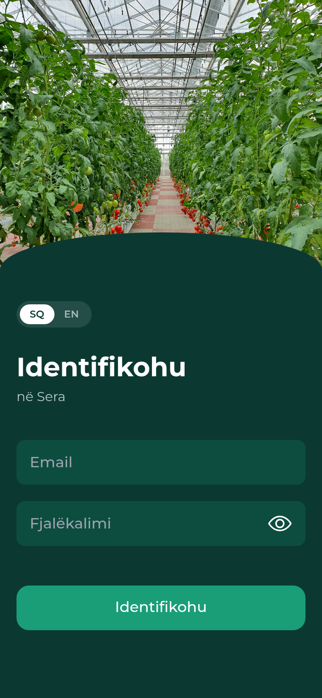
  
  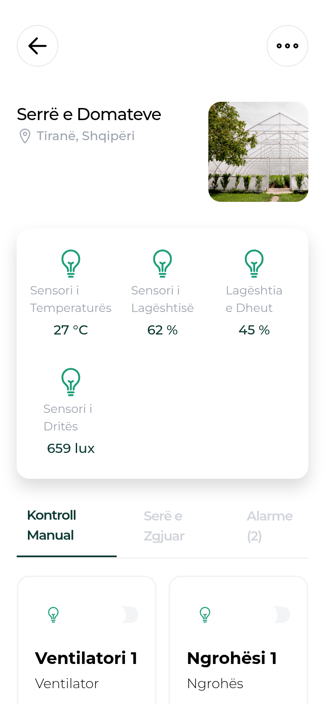
  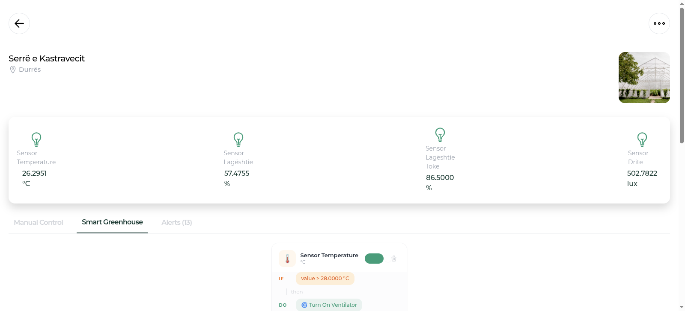
  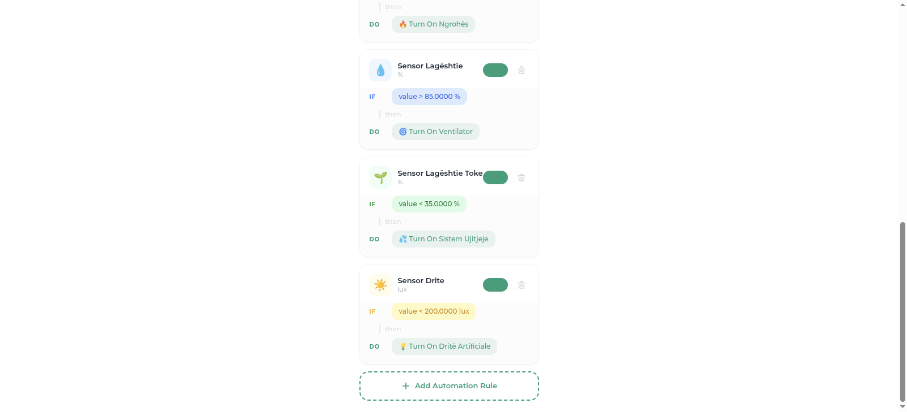
</p>

## Desktop

Every page has a dedicated desktop layout — not just a stretched-out phone view. A sidebar replaces the mobile tab bar, and each page reflows into a layout suited to a wide screen: a split-screen login, a multi-column greenhouse dashboard with live sparklines, and a bottom-sheet-to-centered-modal swap for every form.

<p align="center">
  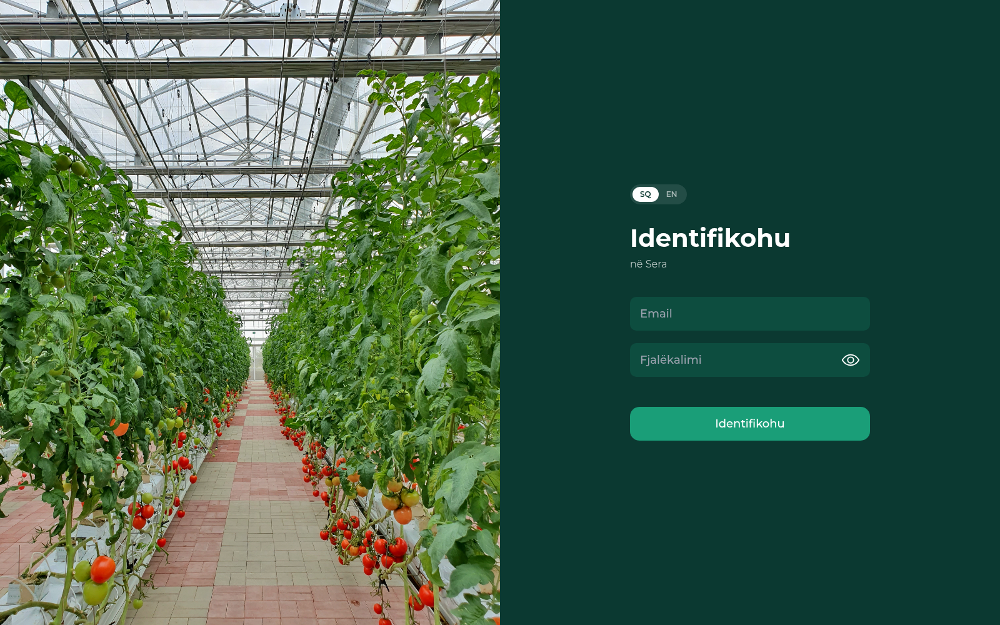
  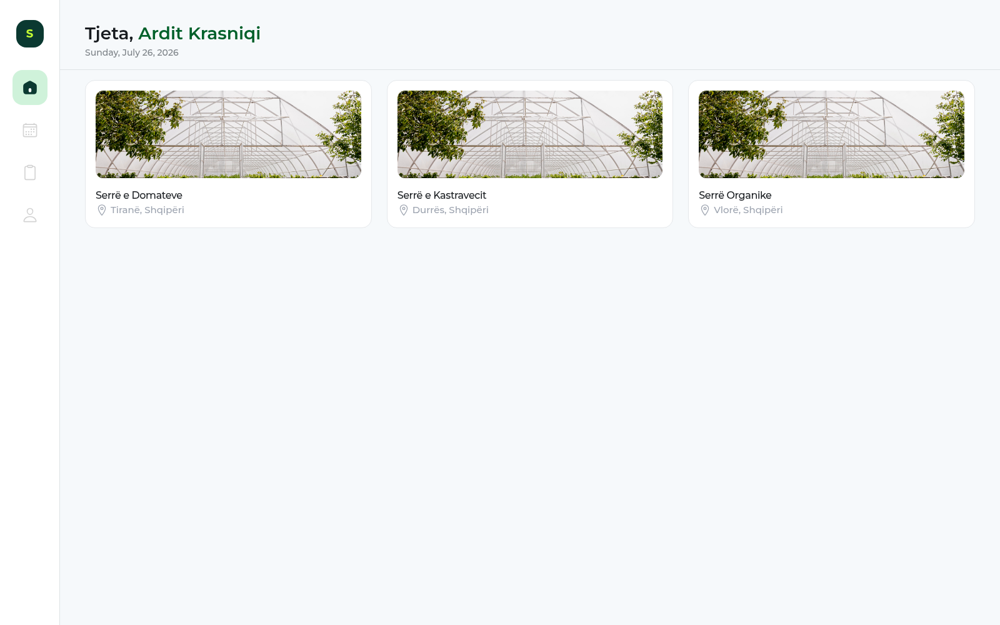
</p>
<p align="center">
  
</p>
<p align="center">
  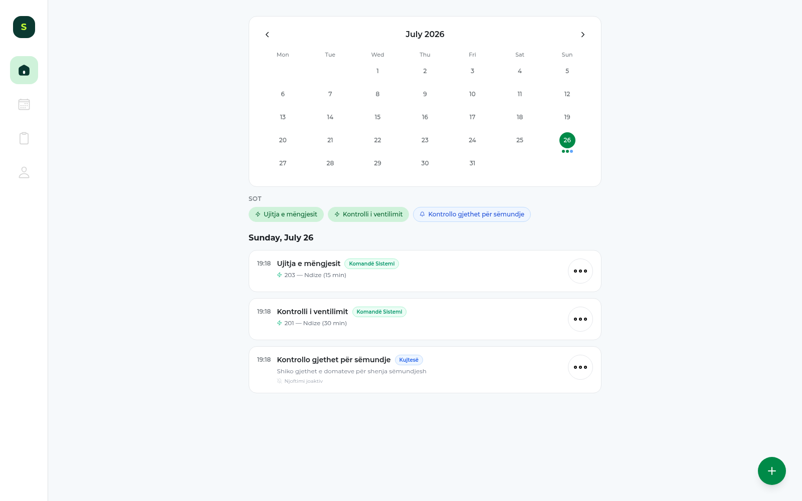
  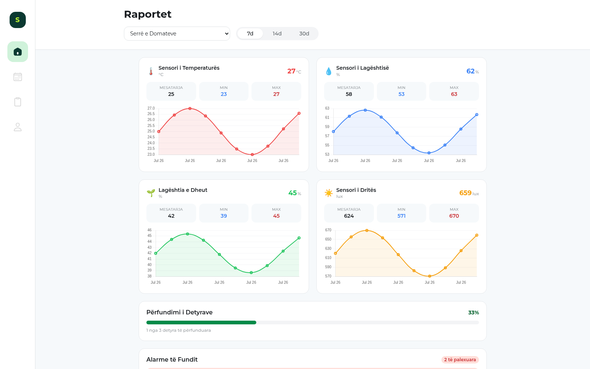
</p>
<p align="center">
  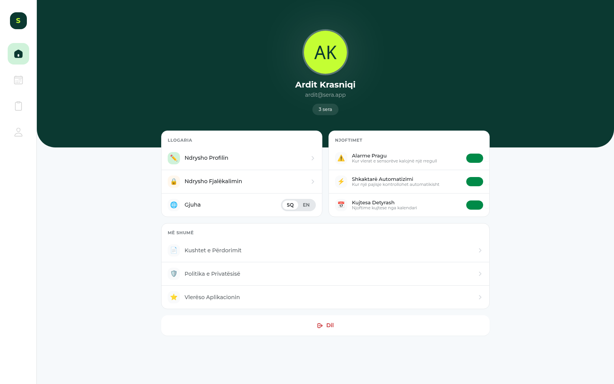
</p>

## Architecture

This is a monorepo with two applications:

```
/
├── app/    Angular 17 + Capacitor app (web, Android, iOS)
└── api/    Laravel 11 REST API + WebSocket server
```

**`app/`** — Standalone Angular components, Signals for local state, RxJS services for shared state, Capacitor for native device access (storage, HTTP, local notifications) and cross-platform builds. Layouts adapt per breakpoint — a mobile tab-bar experience below `lg`, a sidebar-driven dashboard above it — sharing the same components and data. The UI is available in Albanian (default) and English, switchable at any time from the login screen or the profile page; the choice is remembered per device and synced to the user's account.

**`api/`** — Laravel modular monolith exposing a versioned REST API (`/api/v1`) secured with Sanctum tokens. Automation rule evaluation runs asynchronously on a Redis queue, decoupled from the sensor-reading ingestion path. Laravel Reverb powers WebSocket broadcasting to private per-greenhouse channels.

### Data flow

1. A sensor posts a reading to `POST /sensors/{id}/readings`.
2. The reading is persisted and a `SensorReadingCreated` event is dispatched.
3. A queued job evaluates matching automation rules and issues device commands where thresholds are breached.
4. Reverb broadcasts the new reading, any device status change, and any triggered alert to clients subscribed to that greenhouse's private channel.
5. The Angular app updates dashboards live via `pusher-js`, no polling required.

## Tech stack

| | |
|---|---|
| Frontend | Angular 17 (standalone components, Signals), Capacitor, Tailwind CSS |
| Backend | Laravel 11, PHP 8.3, Sanctum, Reverb (WebSockets) |
| Data | MySQL, Redis (cache + queue) |
| Docs/Testing | L5-Swagger (OpenAPI), Pest |
| Infra | Docker Compose, GitHub Actions (CI + deploy) |

## Getting started

### Backend

```bash
cd api
composer install
cp .env.example .env
php artisan key:generate
php artisan migrate --seed
php artisan serve          # http://localhost:8000
php artisan reverb:start   # WebSocket server
php artisan queue:work     # automation rule evaluation
```

### Frontend

```bash
cd app
npm install
npm start                  # http://localhost:4200
```

### Docker

```bash
docker compose up -d
```

Brings up the API, Nginx, MySQL, Redis, a queue worker, and Reverb together.

## Testing

```bash
cd api && php artisan test   # Pest suite: auth, CRUD, policies, throttling
cd app && npm test           # Karma/Jasmine unit tests
```
